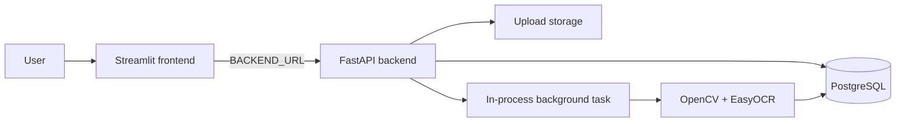

# Vehicle Image Processing System

An asynchronous vehicle-image processing service built for the Backend + AI Engineering take-home assignment. The system accepts vehicle images, persists upload metadata, performs background image-quality and OCR analysis, validates possible Indian registration numbers, and exposes APIs for status and results.

The repository includes a FastAPI backend, PostgreSQL persistence, a Streamlit demonstration frontend, OpenCV/EasyOCR analysis, Docker Compose configuration, and automated tests for core API and validation behavior.

## Assignment Mapping

| Assignment requirement | Implementation |
| --- | --- |
| Accept image uploads | `POST /upload` accepts JPG, JPEG, and PNG multipart uploads. |
| Generate a unique ID | PostgreSQL generates an image ID; the stored filename uses a UUID. |
| Store image and metadata | Image files are saved under `UPLOAD_DIR`; metadata is stored in PostgreSQL. |
| Process asynchronously | FastAPI `BackgroundTasks` starts processing after the upload transaction commits. |
| Track lifecycle state | Images move through `pending`, `processing`, `completed`, and `failed` states. |
| Detect image issues | OpenCV calculates blur and brightness signals; OCR extracts possible text. |
| Validate vehicle numbers | OCR output is normalized and checked against supported Indian registration formats. |
| Return structured results | `GET /result/{image_id}` returns quality, OCR, plate, and remarks fields. |
| Handle failures | Upload validation, database, OCR, timeout, and stale-job failures are recorded or returned as API errors. |
| Persist data | SQLAlchemy models store image metadata and one associated analysis result. |
| Local reproducibility | Docker Compose runs PostgreSQL, the backend, and the frontend together. |
| Demonstration UI | Streamlit provides upload, status, and result views. |
| Tests | Pytest tests cover analysis orchestration, status/result APIs, plate validation, background processing, and database behavior. |

## Architecture



The system is intentionally small and deployable:

- **FastAPI** exposes the upload, status, result, health, and OpenAPI endpoints.
- **PostgreSQL** stores image metadata and structured analysis results.
- **Local upload storage** stores the original image files under the configured upload directory.
- **FastAPI BackgroundTasks** decouple the upload response from expensive analysis.
- **ThreadPoolExecutor** runs OCR work without blocking the Uvicorn event loop.
- **OpenCV** performs blur, brightness, image resizing, color-region detection, and preprocessing.
- **EasyOCR** extracts text from likely plate regions and the full image.
- **Streamlit** provides a lightweight user interface that calls the backend API.
- **Docker Compose** runs the three local services with database and service healthchecks.

## End-to-End Workflow

1. A user selects a JPG, JPEG, or PNG image in the Streamlit frontend.
2. The frontend sends the file to `POST /upload`.
3. The backend validates the filename extension and declared MIME type.
4. The upload is streamed to disk while checking JPEG/PNG magic bytes and the 10 MB size limit.
5. A UUID-based filename prevents collisions while the original filename is retained as metadata.
6. An `images` row is inserted with status `pending`.
7. The database transaction commits before background processing is scheduled.
8. The API immediately returns the database image ID and current status.
9. Background processing changes the image status to `processing`.
10. OpenCV calculates blur and brightness signals.
11. EasyOCR analyzes likely plate regions and the full image.
12. OCR text is normalized and checked against supported Indian registration formats.
13. The structured result is saved in `analysis_results`.
14. The image status becomes `completed`, or `failed` if processing raises an error or exceeds the configured timeout.
15. A client polls the status endpoint and retrieves the result after completion.

## API Reference

The backend runs on port `8000` locally. Swagger UI is available at `/api/docs`.

### `POST /upload`

Accepts a multipart image upload and returns immediately after the file and metadata have been persisted.

Supported formats:

- `.jpg`
- `.jpeg`
- `.png`

The upload is also checked for:

- declared MIME type (`image/jpeg` or `image/png`)
- JPEG or PNG file signature
- non-empty content
- maximum size of 10 MB

Example:

```bash
curl -X POST http://localhost:8000/upload \
  -H "accept: application/json" \
  -F "file=@vehicle.jpg"
```

Response:

```json
{
  "id": 1,
  "status": "pending"
}
```

### `GET /status/{image_id}`

Returns the persisted processing state and upload metadata.

```bash
curl http://localhost:8000/status/1
```

Example response:

```json
{
  "id": 1,
  "filename": "vehicle.jpg",
  "status": "completed",
  "created_at": "2026-07-22T09:02:19.000000",
  "updated_at": "2026-07-22T09:03:40.000000"
}
```

Possible status values are:

- `pending`: uploaded and waiting for processing
- `processing`: background analysis is running
- `completed`: analysis result was persisted
- `failed`: processing failed or timed out

### `GET /result/{image_id}`

Returns the structured result when an analysis record exists.

```bash
curl http://localhost:8000/result/1
```

Example response:

```json
{
  "id": 1,
  "image_id": 1,
  "blur_score": 293.8,
  "is_blurry": false,
  "brightness_score": 142.35,
  "low_light": false,
  "plate_text": "MH12AB1234",
  "extracted_text": "MH 12 AB 1234\nPUNE FC ROAD",
  "plate_valid": true,
  "duplicate": false,
  "remarks": "Image is sharp enough. Valid registration number.",
  "completed_at": "2026-07-22T09:03:40.000000"
}
```

If processing has not produced a result, the endpoint returns `404` with:

```json
{
  "detail": "Analysis result is not available yet."
}
```

The equivalent resource-style routes are also available:

- `GET /images/{image_id}/status`
- `GET /images/{image_id}/result`

### Health and API documentation

- `GET /health` checks API and database readiness.
- `GET /` returns basic API information.
- `/api/docs` opens Swagger UI.
- `/api/redoc` opens ReDoc.
- `/api/openapi.json` returns the OpenAPI schema.

## Image Analysis Pipeline

### Blur detection

The blur score is calculated using the variance of the Laplacian. Lower variance generally indicates fewer sharp edges and a potentially blurry image. The result is compared with the configured blur threshold and exposed as `is_blurry`.

This is a quality heuristic, not a semantic assessment of whether a vehicle or plate is readable.

### Brightness detection

The image is converted to grayscale and its mean pixel intensity is calculated. A low mean intensity is flagged as `low_light`.

The API exposes the raw brightness score and the boolean low-light decision.

### OCR extraction

EasyOCR is initialized once per backend process using an in-process cache. The current deployment is CPU-based (`gpu=False`).

The OCR pipeline:

1. Bounds very large images to a maximum OCR dimension of 1600 pixels.
2. Examines the lower portion of the image where a vehicle plate is likely to appear.
3. Uses yellow-region contours and fallback strips to create candidate regions.
4. Enlarges candidate regions and applies contrast enhancement, thresholding, and sharpening.
5. Runs OCR on the original enlarged, binary, and sharpened variants.
6. Runs a full-image OCR pass.
7. Filters low-confidence detections and deduplicates extracted text.

The OCR output is probabilistic. A missed or incorrectly read plate is expected for poor lighting, blur, occlusion, unusual viewpoints, or images where the plate is too small.

### Indian registration-number validation

`app/plate_validation.py` normalizes OCR text, removes common separators, applies selected OCR corrections, and searches for supported formats including:

- standard Indian registrations such as `MH12AB1234`
- Bharat Series registrations such as `01BH1234AB`

The validator contains a list of recognized Indian state and territory codes and supports split OCR tokens through line/window matching. It reports the first valid match as `plate_text` and exposes the result as `plate_valid`.

### Duplicate, screenshot, and tamper analysis

The result schema contains a `duplicate` field, but the current analysis path returns `duplicate: false` rather than computing an image similarity comparison. Duplicate detection is therefore represented in the schema but is not a complete implemented check.

Screenshot detection, photo-of-photo detection, metadata analysis, and tamper/edit detection are not currently implemented. They are documented as future extensions rather than reported as existing capabilities.

## Database and Data Model

The application uses SQLAlchemy with PostgreSQL.

### `images`

Stores upload metadata and lifecycle state:

- `id`: integer primary key
- `filename`: original client filename
- `filepath`: unique path of the stored file
- `status`: `pending`, `processing`, `completed`, or `failed`
- `created_at`: upload timestamp

Each image has at most one associated analysis result in the current model.

### `analysis_results`

Stores the output of processing:

- `id`: integer primary key
- `image_id`: foreign key to `images`
- `blur_score`
- `brightness_score`
- `plate_text`
- `extracted_text`
- `plate_valid`
- `duplicate`
- `remarks`
- `completed_at`

Tables are initialized at application startup by the current database setup. The project does not currently use Alembic migrations.

## Asynchronous Processing Design

The upload endpoint is asynchronous from the client’s perspective: it commits the image metadata and schedules `process_image` before returning the processing ID.

The actual OCR call runs through a shared `ThreadPoolExecutor` with four workers. The worker’s future is given the configured processing timeout. A timed-out or failed future is recorded as a failed image result instead of leaving the image indefinitely in `processing`.

On backend startup, `recover_stale_processing_jobs()` finds rows left in `processing` by a previous process and marks them failed with an interruption remark.

### Why this approach

For a take-home project, FastAPI background tasks and an in-process executor provide:

- a small operational footprint
- no additional queue infrastructure
- immediate upload responses
- explicit persisted state transitions
- straightforward local Docker execution

### Trade-offs

This is not a durable distributed queue:

- jobs can be interrupted if the backend container is terminated
- queued work exists only in the backend process
- multiple backend replicas do not share the same in-memory executor
- there is no automatic retry with backoff
- long CPU OCR tasks compete for container resources

A production version could move processing to a durable queue and separate worker service using Redis/Celery, RabbitMQ, SQS, or another managed job system.

## Error Handling and Reliability

The upload path handles:

- unsupported extensions with HTTP `415`
- unsupported MIME types with HTTP `415`
- invalid JPEG/PNG signatures with HTTP `415`
- empty files with HTTP `400`
- files above 10 MB with HTTP `413`
- database failures with HTTP `500`
- cleanup of a stored file if metadata persistence fails

The status and result routes return HTTP `404` for unknown image IDs. Results requested before an analysis record exists also return HTTP `404`.

Background processing:

- persists `processing` before OCR begins
- records OCR and persistence failures as `failed`
- records timeout failures using `PROCESSING_TIMEOUT_SECONDS`
- closes database sessions in success and failure paths
- recovers stale processing jobs during startup

Automatic retries are not currently implemented. A future queue worker should use bounded retries, exponential backoff, and a dead-letter policy for permanently failing jobs.

## Project Structure

```text
vehicle-image-processing-system/
├── app/
│   ├── __init__.py
│   ├── analysis.py            # OpenCV and EasyOCR pipeline
│   ├── background.py          # Background worker and lifecycle handling
│   ├── config.py              # Environment-backed configuration
│   ├── database.py            # SQLAlchemy engine and initialization
│   ├── main.py                # FastAPI application and startup
│   ├── models.py              # Image and AnalysisResult models
│   ├── plate_validation.py    # Indian registration validation
│   ├── routes.py              # Upload, status, and result endpoints
│   ├── schemas.py             # Pydantic response schemas
│   └── utils.py               # Upload validation and storage helpers
├── frontend/
│   ├── app.py                 # Streamlit interface
│   ├── api.py                 # Backend API client
│   ├── requirements.txt       # Frontend dependencies
│   └── ...
├── test_analysis.py
├── test_background.py
├── test_db_connection.py
├── test_plate_validation.py
├── test_result.py
├── test_status.py
├── Dockerfile.backend
├── Dockerfile.frontend
├── docker-compose.yml
├── requirements.txt
├── create_tables.py
└── README.md
```

## Environment Variables

| Variable | Purpose | Example |
| --- | --- | --- |
| `DATABASE_URL` | PostgreSQL SQLAlchemy connection string | `postgresql://postgres:postgres@db:5432/vehicle_db` |
| `UPLOAD_DIR` | Image storage directory | `/app/uploads` |
| `OCR_MODEL_DIR` | EasyOCR model directory | `/app/easyocr-models` |
| `PROCESSING_TIMEOUT_SECONDS` | Maximum processing wait before failure | `180` |
| `DEBUG` | Application debug configuration | `False` in production |
| `SQL_ECHO` | SQLAlchemy SQL logging toggle | `False` |
| `BACKEND_URL` | Backend URL used by Streamlit | `http://backend:8000` locally |
| `POSTGRES_USER` | PostgreSQL Compose user | `postgres` |
| `POSTGRES_PASSWORD` | PostgreSQL Compose password | use a secret outside local development |
| `POSTGRES_DB` | PostgreSQL Compose database name | `vehicle_db` |

Never commit production database credentials. For Railway, use the managed PostgreSQL service’s `DATABASE_URL` reference and set the frontend’s `BACKEND_URL` to the deployed backend URL.

## Running with Docker Compose

### Start the complete system

```bash
docker compose up --build
```

The services are:

- `db`: PostgreSQL 16
- `backend`: FastAPI on port `8000`
- `frontend`: Streamlit on port `8501`

Useful commands:

```bash
# Start in the background
docker compose up -d

# View all logs
docker compose logs -f

# View one service
docker compose logs -f backend
docker compose logs -f frontend
docker compose logs -f db

# Stop containers
docker compose down

# Stop containers and delete database/upload volumes
docker compose down -v

# Rebuild after source changes
docker compose up -d --build
```

Access the running system at:

- Frontend: `http://localhost:8501`
- Backend: `http://localhost:8000`
- Swagger UI: `http://localhost:8000/api/docs`
- ReDoc: `http://localhost:8000/api/redoc`
- Health check: `http://localhost:8000/health`

The first backend build can take longer because EasyOCR model files are initialized during the Docker image build. Later builds reuse the cached model layer unless dependency or Dockerfile inputs change.

## Running Without Docker

For local development without Compose:

1. Install Python 3.12 or newer.
2. Create and activate a virtual environment.
3. Install backend dependencies.
4. Install frontend dependencies.
5. Start PostgreSQL and configure `DATABASE_URL`.
6. Start the backend and frontend in separate terminals.

```bash
python3.12 -m venv .venv
source .venv/bin/activate
pip install -r requirements.txt
pip install -r frontend/requirements.txt
```

Start the backend from the repository root:

```bash
uvicorn app.main:app --host 0.0.0.0 --port 8000 --reload
```

Start the frontend from the `frontend` directory:

```bash
cd frontend
streamlit run app.py
```

For a non-Docker frontend, set:

```bash
BACKEND_URL=http://localhost:8000
```

## Testing

The project uses Pytest. Tests cover:

- analysis orchestration and OCR failure propagation
- background processing behavior
- database connectivity
- Indian plate normalization and validation
- result response fields and unavailable results
- lifecycle status responses and invalid IDs

Run the test suite from the repository root:

```bash
pytest
```

Some tests use mocks and dependency overrides so API behavior can be tested without running the full OCR pipeline. Integration tests that require PostgreSQL should use a configured test database.

## Railway Deployment

Deploy the Compose services as separate Railway services:

1. Create a Railway project.
2. Add a Railway PostgreSQL service.
3. Add a backend service from the repository using `Dockerfile.backend`.
4. Add a frontend service from the repository using `Dockerfile.frontend`.
5. Configure the backend `DATABASE_URL` from the Railway PostgreSQL service.
6. Set backend variables:

```text
DEBUG=False
UPLOAD_DIR=/app/uploads
OCR_MODEL_DIR=/app/easyocr-models
PROCESSING_TIMEOUT_SECONDS=180
```

7. Generate a public domain for the backend.
8. Set the frontend variable:

```text
BACKEND_URL=https://<generated-backend-domain>
```

9. Generate a public domain for the frontend.
10. Add a persistent Railway volume mounted at `/app/uploads` if uploaded files must survive backend restarts.

Configure healthchecks for:

- Backend: `/health`
- Frontend: `/_stcore/health`

Railway deployments should be tested with the actual generated domains rather than hard-coded example domains. EasyOCR runs in CPU mode, so the backend may require additional memory and processing time for difficult images or concurrent uploads.

## Security and Validation

Implemented upload protections include:

- permitted file extensions
- permitted MIME types
- JPEG/PNG magic-byte validation
- 10 MB maximum upload size
- UUID-based storage filenames
- cleanup when database persistence fails
- no credentials required in source code

Production improvements still needed include:

- authentication and authorization
- rate limiting
- malware scanning
- stronger image decompression-bomb protections
- private object storage and signed access
- secret management
- restricted CORS origins
- structured audit logging

The current FastAPI CORS configuration allows all origins for development and should be restricted before production use.

## Observability and Operations

Current operational signals include:

- Uvicorn request logs
- health endpoint checks
- processing success and failure logs
- OCR exception logs
- timeout logs
- stale-job recovery logs
- Docker service healthchecks

Useful next steps would be metrics for queue depth, OCR duration, processing success rate, timeout rate, memory usage, and per-stage latency, along with structured JSON logs and distributed tracing.

## Design Decisions

### FastAPI

FastAPI provides typed request/response validation, automatic OpenAPI documentation, and a small API surface suitable for the assignment.

**Trade-off:** the current in-process task model is simple but is not a durable distributed queue.

### PostgreSQL

PostgreSQL provides durable relational storage for upload metadata, lifecycle state, and structured results.

**Trade-off:** a managed production deployment still needs migration management, backups, connection-pool tuning, and retention policies.

### Local filesystem storage

Local storage keeps the take-home project easy to run and inspect.

**Trade-off:** container filesystems are not suitable for durable multi-instance production storage without a persistent volume or object storage.

### OpenCV and EasyOCR

The combination provides practical quality heuristics and OCR without requiring a custom trained model.

**Trade-off:** CPU OCR can be slow and OCR accuracy varies with image quality and viewpoint.

### Streamlit

Streamlit provides a small demonstration UI without introducing a separate JavaScript application.

**Trade-off:** it is not intended to replace a production frontend with authentication, automatic polling, and richer client-side state management.

## Trade-offs and Simplifications

This implementation intentionally simplifies several production concerns to stay within take-home scope:

- in-process background work instead of a durable queue
- local upload storage instead of object storage
- CPU OCR instead of GPU infrastructure
- heuristic analysis instead of a trained vehicle/plate detection model
- no automatic retry policy
- no authentication or rate limiting
- no completed duplicate-image comparison
- no screenshot, photo-of-photo, or tamper classifier
- limited observability beyond application logs and healthchecks

The goal is a practical, debuggable baseline rather than a claim of perfect computer-vision accuracy.

## Scalability Concerns and Next Steps

The main scaling constraints are EasyOCR CPU and memory usage, the fixed in-process worker pool, local file storage, and the lack of a durable queue.

A production evolution could:

1. Move processing to a dedicated worker service backed by Redis, RabbitMQ, SQS, or another durable queue.
2. Add bounded retries, exponential backoff, and a dead-letter queue.
3. Store originals and derived artifacts in S3-compatible object storage.
4. Use perceptual hashes for real duplicate detection.
5. Add confidence scores and human-review states.
6. Use GPU-enabled or faster OCR infrastructure where justified.
7. Add authentication, rate limiting, and signed result access.
8. Add database migrations, retention jobs, and storage cleanup.
9. Add metrics, tracing, structured logs, and alerting.
10. Add integration and performance tests for realistic image sizes and concurrency.

## AI Usage Disclosure

AI tools were used during development for repository exploration, debugging, documentation, code review, performance analysis, and deployment reasoning.

AI assistance was used to:

- inspect the service and file structure
- reason about FastAPI background processing and failure states
- analyze Docker build logs and EasyOCR startup behavior
- identify CPU OCR as the dominant processing cost
- diagnose a real 180-second image-processing timeout
- suggest bounded OCR candidate/variant processing and image resizing
- identify and update the deprecated Streamlit image sizing API
- reason about Railway’s separate service and storage model
- draft and review project documentation

AI output was validated against the actual source code, Docker configuration, API schemas, tests, and runtime logs. Suggestions were not accepted blindly. For example, runtime logs showed that the build itself was fast after caching but OCR processing could time out on CPU, which led to targeted changes in candidate limits, OCR variants, and maximum OCR image dimensions rather than treating the Docker build as the root cause.

The implementation still requires normal engineering review, test execution, and deployment verification. AI-assisted analysis does not replace those checks.

## Known Limitations

- EasyOCR currently runs on CPU.
- OCR and plate recognition are heuristic and probabilistic.
- Difficult images may take a long time to process.
- Background jobs are tied to the backend process.
- Jobs can be interrupted by container termination.
- Automatic retries are not implemented.
- Uploaded files require persistent storage in production.
- Duplicate detection is represented in the result schema but currently defaults to `false`.
- Screenshot, photo-of-photo, and tamper detection are not implemented.
- Authentication and rate limiting are not implemented.
- CORS is permissive for development and should be restricted in production.

## Sample API Scenario

Upload an image:

```bash
curl -X POST http://localhost:8000/upload \
  -F "file=@vehicle.jpg"
```

Initial response:

```json
{
  "id": 1,
  "status": "pending"
}
```

Poll status:

```bash
curl http://localhost:8000/status/1
```

Processing response:

```json
{
  "id": 1,
  "filename": "vehicle.jpg",
  "status": "processing",
  "created_at": "2026-07-22T09:02:19",
  "updated_at": null
}
```

Completed result:

```bash
curl http://localhost:8000/result/1
```

```json
{
  "id": 1,
  "image_id": 1,
  "blur_score": 293.8,
  "is_blurry": false,
  "brightness_score": 142.35,
  "low_light": false,
  "plate_text": "MH12AB1234",
  "extracted_text": "MH 12 AB 1234",
  "plate_valid": true,
  "duplicate": false,
  "remarks": "Image is sharp enough. Valid registration number.",
  "completed_at": "2026-07-22T09:03:40"
}
```

If processing fails, status becomes `failed` and the analysis result contains a failure remark, such as a processing timeout or generic processing failure.

## Assumptions

- The primary input is a vehicle image containing a potentially visible registration plate.
- JPG, JPEG, and PNG are sufficient for the assignment scope.
- OCR output cannot be guaranteed to be correct.
- A valid result may contain no plate text when the image is unclear or the plate is not visible.
- Local filesystem storage is acceptable for local development and take-home evaluation.
- PostgreSQL is available through Docker Compose or an externally configured database.
- Clients poll status rather than holding an upload request open until OCR completes.
- Production deployment requires persistent upload storage and stronger security controls.

## Conclusion

This project demonstrates a practical asynchronous media-processing backend with typed APIs, durable metadata, background OCR, image-quality heuristics, Indian registration validation, failure handling, Dockerized local execution, and a simple client interface. Its design intentionally favors clarity and debuggability while documenting the queue, storage, CPU, and detection limitations that would need to be addressed in a production-scale system.
